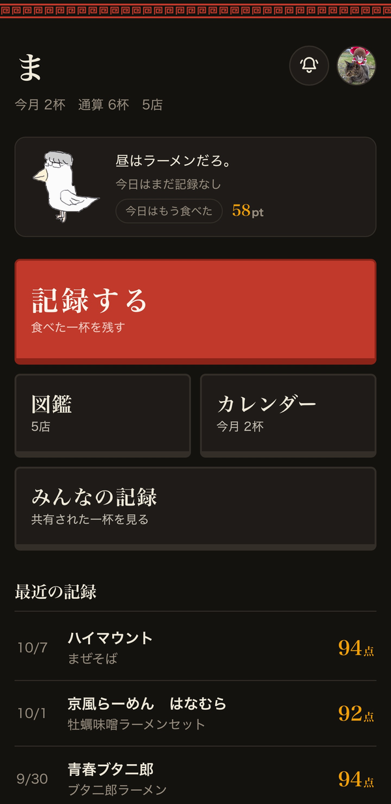
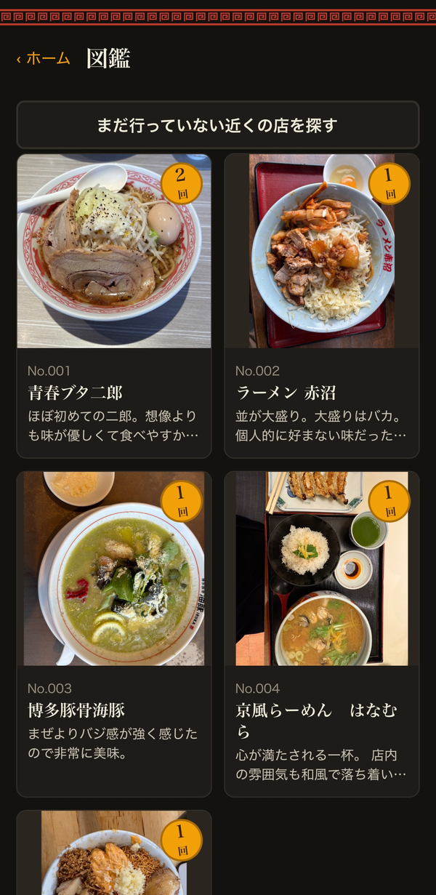
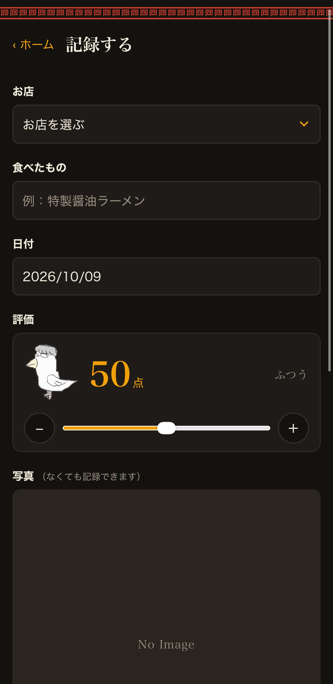

# ま

**食べるたびに、積み重なる。** 
食べたまぜそば・ラーメンを記録して、友人と共有できるiPhone向けWebアプリ（PWA）

[**▶ アプリを開く**](https://ho43.github.io/ramen-app/)　｜　制作期間：2026年9月11日〜（更新中）　｜　提出時点の版：v47

---

|                               ホーム                               |                               図鑑                                |                              記録する                              |
| :----------------------------------------------------------------: | :---------------------------------------------------------------: | :----------------------------------------------------------------: |
|  |  |  |

## 概要

まぜそばを中心に、食べたラーメンを1杯ずつ記録し、記録がお店ごとの「図鑑」として積み重なっていくアプリです。
友人グループ向けのSNS機能もあり、現在は**自分を含む9人**が使っています。
友人には開発中のテストから協力してもらっていて、正式にリリースしたときには「ついに来たか！」と喜んでもらえました。

- **担当**：企画・仕様の決定・動作確認・運用（キャラクターデザインのみ友人）
- **開発の進め方**：AI（Claude）と協働して開発
- **大切にしていること**：長く使ってほしいので、急がず、ゆったりと記録を積み重ねていけること

> **お試しについて**
> 記録・図鑑・カレンダーは、ログインしなくても[アプリのURL](https://ho43.github.io/ramen-app/)から試せます（スマートフォン向けの画面です）。
> 共有などのSNS機能は登録メンバー限定のため、ポートフォリオのデモ動画をご覧ください。

## 作ったきっかけ

週に1回ほど、友人とラーメンを食べに行きます。でも記録は特に残しておらず、一度しか行っていない店だと「何がおいしかったか」「自分の中で何点くらいだったか」を思い出せないことがよくありました。
私は毎日、ゲームと生活の2種類の日記を書いていて、積み上げてきたものを振り返る時間が好きです。まぜそばやラーメンも同じように積み重ねて振り返れたら楽しいだろうと思い、作り始めました。

**名前の由来**：「ま」は、まぜそばの頭文字です。はまっていたころは「ま」の一文字でまぜそばを思い浮かべるほどでした。
「**あなたはまだ、まぜそばの『ま』の字しか知らない。**」記録を重ねて、まぜそばを知り尽くしてほしいという思いも込めています。

## マスコット「ギルチキ」

記録アプリは、外食をしたときくらいしか開かないため、アプリのことを忘れられがちです。
そこでキャラクターを入れ、毎日餌をあげられるようにしました。食べに行かない日もアプリを開くきっかけを作るためです。

餌やりでもらえるポイントはランダムで、履歴も振り返れるため、友人の間で「今日何ポイントだった？」という会話が生まれ、履歴を見せ合って盛り上がっています。

ギルチキは、絵しりとりのようなゲーム「Gartic Phone」で、友人が描いた絵から偶然生まれたキャラクターです。

## 主な機能

- **記録**：写真・店名・食べたもの・点数（0〜100点）・ひとことを記録。95点以上で「ギルティ！」演出
- **図鑑・カレンダー**：記録がお店ごとの図鑑と月ごとのカレンダーに積み重なる
- **ギルチキ**：記録や時間帯に合わせて話しかけてくる。餌やり・ガチャ・着せ替え・おすすめの一杯
- **みんなの記録**：選んだ記録を共有。ギルティ（いいね）・コメント・フォロー・「一緒に食べた人」のタグ付け
- **通知**：共有・ギルティ・コメント・フォローをプッシュ通知でお知らせ
- **近くの店**：まだ行っていない近くのラーメン店を探す

## 技術構成

| 分類             | 使った技術                                             |
| ---------------- | ------------------------------------------------------ |
| アプリ本体       | HTML / CSS / JavaScript、PWA                           |
| 自分の記録の保存 | IndexedDB（端末の中）                                  |
| ログイン・共有   | Firebase Authentication、Cloud Firestore               |
| 通知             | Cloud Functions for Firebase、Firebase Cloud Messaging |
| お店の検索       | Google Places API                                      |
| 公開             | GitHub Pages                                           |

<b>データの流れとFirebaseを選んだ理由</b>

**データの流れ**

1. 記録すると、まずスマホの中に保存される
2. 共有を選ぶと、その記録だけがFirebaseのデータベースに保存される
3. 保存されたことをきっかけに、サーバー側のプログラム（Cloud Functions）が自動で動き、ほかのメンバーのiPhoneに通知を送る

**Firebaseを選んだ理由**
GitHub Pagesはファイルを公開するだけの仕組みなので、友人と記録を共有するには、別にデータを保存できる場所が必要でした。
できる限り無料で済ませたかったことと、ログイン・データベース・通知が1つのサービスにまとまっていて、自分でサーバーを用意したり管理したりしなくてよいことから、Firebaseを選びました。

## 開発の記録

見出しをクリックすると開きます。

<b>こだわったこと</b>

- **WindowsだけでiPhoneアプリを届ける**
  開発に使えるのがWindowsのパソコンだけで、App Storeでの配布は難しい環境でした。そこで、Safariからホーム画面に追加して使えるWebアプリ（PWA）にし、GitHub Pagesで無料公開する形を選びました。
- **「ギルティ！」の基準**
  最初は90点以上で「ギルティ！」が出る設定でしたが、ギルティ演出にもっと特別感を持たせたかったので、95点以上に上げました。
- **ギルチキの口調**
  下手に出すぎない、短めのタメ口にしました。
- **新機能と調整を分ける**
  機能を足し続けるのではなく、いったん区切って使い勝手の調整やバグ修正をしてから正式リリースしました。今も「新機能」と「調整」を分けて更新しています。

<b>工夫したこと</b>

- **記録はスマホの中に、共有は選んだものだけ**
  最初は自分用の記録アプリとして作ったので、記録はスマホの中に保存していました。あとから友人と記録を見せ合いたくなって共有機能を追加しましたが、全部の記録が見られるのは嫌だと思ったので、見せたい記録だけを選んで共有する形にしました。記録はスマホの中にあるので、電波がなくても記録できます。
- **起動を速くする**
  以前はアプリを開くたびにアプリのファイルをネットから取り直していたため、電波が弱いと起動に時間がかかっていました。そこで、前に保存しておいたファイルで先に画面を出し、新しいファイルは裏で取り直すようにしました。ログインや共有に使うFirebaseの部品も、共有の画面を開いたときに初めて読み込むようにしています。
- **記録を勝手に見られない・書き換えられないようにする**
  Firebaseのルールで、許可したメールアドレスのメンバーしか記録を読み書きできないようにしています。メンバー同士でも、記録の編集や削除は投稿した本人しかできず、ギルティも自分のぶんしか付け外しできないように制限しています。
- **APIの料金がかかりすぎないようにする**
  近くの店を探す機能で使っているGoogleのAPI（Places API）は、月に無料で使える分が決まっています。アプリ側で1台につき1日3回までに制限し、取得する情報も店名と住所などに絞って、無料の範囲に余裕をもって収まるようにしています。APIキーはこのサイトからしか使えないように制限し、万が一料金が発生したときはメールで知らせが届くように設定しています。
- **更新を確実に届ける**
  アプリを開いたときに、GitHubに上がっている最新の版の番号と今の版の番号を比べ、新しい版があれば画面いっぱいに更新画面を出します。以前は消せる小さなお知らせを出すだけで、更新されたのかどうか分からない状態になっていたため、確実に気づける形に変えました。細かい修正のときは版の番号を上げずに静かに反映し、知らせたい変更のときだけ更新画面とアプリ内の「お知らせ」で伝えています。

<b>苦労したこと：初めて触るツールばかりだった、プッシュ通知の実装</b>

通知を送るには、アプリの外で動くサーバー側の仕組み（Cloud Functions）が必要で、Firebaseの有料プランへの切り替えや、パソコンから設定を送るためのツール（Firebase CLI）の導入など、どれも初めて触るものでした。
AIに手順を一つずつ確認しながら設定を進め、実際に友人の端末へ通知が届くところまで形にしました。

実装の途中では、1件の通知が2つ表示されるトラブルも起きました。原因は、Firebaseが自動で通知を表示してくれるのに、アプリ側でも表示する処理を書いていたことでした。アプリ側の処理を消して表示をFirebaseに任せることで解決しました。

<b>AIとの開発の進め方</b>

コードの多くは、AI（Claude）と対話しながら書きました。

1. 作りたい機能や直したい点を、自分の言葉で仕様にまとめてAIに伝える
2. できたものを、自分とテストに協力してくれた友人のiPhoneで実際に使って確かめる
3. 友人の反応や、使っていて気になった点をもとに直す

私は企画、仕様の決定、動作確認、Firebaseの設定、リリースと更新の運用を担当しました。このサイクルを繰り返し、v47まで更新を重ねています。

**思った通りに動かなかったとき**
AIが作ったものが思った通りに動かないことは、何度もありました。そのときは実機で何度も動作を確かめて違和感を見つけ、「どんなときに・何をすると・どうなってしまうか」と「どう直してほしいか」をAIに伝えて直しました。実際に見つけて直した不具合の例です。

- 画面を何段階か進んでから「戻る」を押すと、来た画面ではなく別の画面に飛んでしまう → 通ってきた画面に順番に戻るように直した
- プロフィールの読み込み中にホームへ戻ると、あとからプロフィールが表示されて戻れなくなる → 読み込みが終わる前に別の画面へ移ったら、表示しないように直した
- 返信は送れているのに「うまくいきませんでした」と表示される → 送れたときは正しく表示されるように直した

<b>友人の声から直したこと・見送ったアイデア</b>

テストに協力してくれた友人からも、不具合の報告や機能の提案をもらい、実装に反映しました。

- **不具合の報告**：共有した記録の説明文が長いと、一覧で途中までしか表示されない → 長いときは記録を開くと全文を読めるように直した
- **機能の提案**：共有した記録が増えるほどバッジがもらえる機能 → 共有するたびに次のバッジまでのゲージがたまり、区切りに届くと演出とともにバッジが手に入る形で実装した

一方で、考えた末に実装しなかったアイデアもあります。

- **期間限定イベント**：利用人数を考えると盛り上がりにくいことに加え、期間中に何杯も食べに行くのは金銭的に難しく、イベントのために記録を増やすことができないため見送りました
- **その日一番おいしそうな写真を投票で選ぶバッジ**：写真の出来には大きな差がなく、その日一緒に行っていない人はもらえない不公平さもあるため見送りました
- **3日以上連続で記録するともらえるバッジ**：記録を急かしているように感じたため見送りました

このアプリは長く使ってほしいので、急がず、ゆったりと記録を積み重ねていけることを大切にしています。

## 今後の予定

- 食べたものをジャンル（家系・まぜそば・二郎系など）ごとに分けて見られるようにする
- 共有された記録から、ギルティ数や点数の月間ランキングを作る

<b>ファイル構成</b>

| ファイル              | 役割                                                      |
| --------------------- | --------------------------------------------------------- |
| `index.html`          | アプリの入り口                                            |
| `app.js`              | 画面の表示と操作                                          |
| `style.css`           | 見た目                                                    |
| `db.js`               | 端末内の保存（IndexedDB）                                 |
| `cloud.js`            | Firebase（ログイン・共有・通知）とのやり取り              |
| `firebase-config.js`  | Firebaseへの接続情報                                      |
| `sw.js`               | オフライン対応と通知の受け取り（Service Worker）          |
| `manifest.json`       | ホーム画面に追加したときの名前とアイコン                  |
| `firestore.rules`     | Firestoreのセキュリティルール                             |
| `icons/`、`*.png`     | アイコン、ギルチキ、アバター、バッジの画像                |
| `docs/DEVELOPMENT.md` | 実装の決めごとや運用手順の[開発メモ](docs/DEVELOPMENT.md) |

## クレジット

- マスコットキャラクター「ギルチキ」のデザイン：友人（画像の転載・再利用はご遠慮ください）
- 開発：[Ho43](https://github.com/Ho43)
